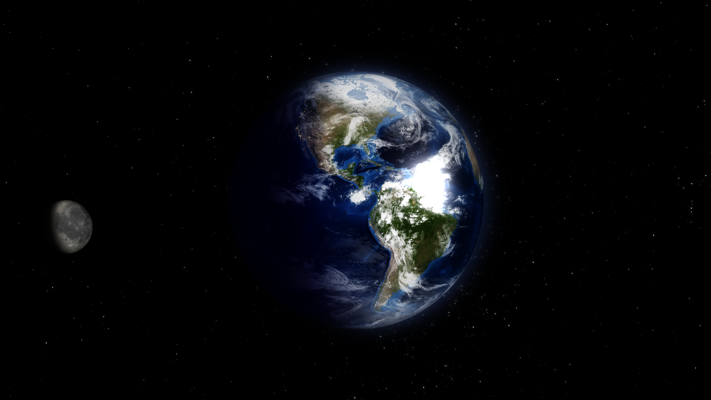

# crystalliser-nonbot
Fork of [Autophagys](https://github.com/Autophagy) image-crystallising [twitter
bot](https://twitter.com/crystalliser) in which I removed the twitter
functionality in order to use this as a command line tool.

Personally I use this to modify pictures generated by xplanetFX(see examples)

The original author did a [small write-up](http://www.deadcells.org/crystalliser-twitter-bot/) 
about the project on her site.

## Usage
```
$ python crytalliser.py input.png output.png
```

## Example input


## Example output


## To-Do
* Let the user choose chunk size as command line argument(at the moment fixed
  to 8)
